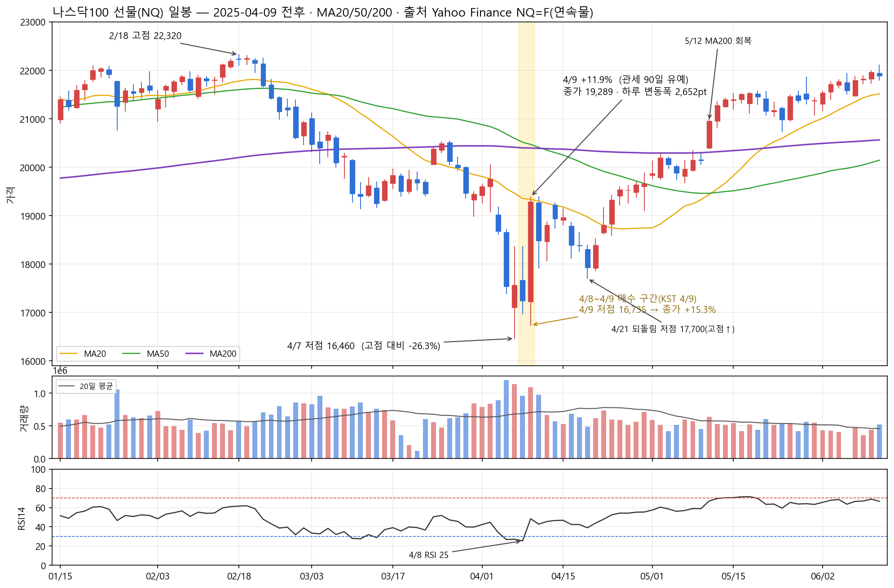
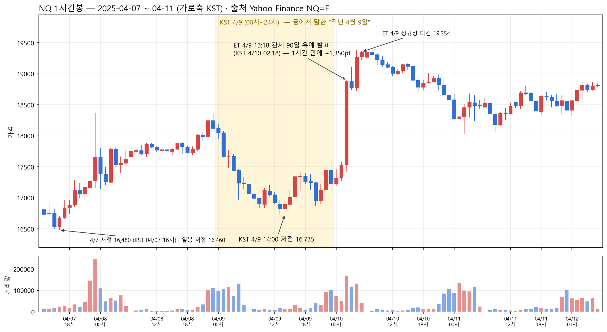

# 게시판별 정리 — 선배님 블로그(pillion21) 20년

> 블로그가 나눠 놓은 게시판 순서와 이름을 그대로 따랐습니다.
> 글 762편(2006-06-17 ~ 2026-08-30, 118만 자)을 전부 읽고 정리했습니다.
> 인용은 최소로 하고 요약·재서술 위주입니다. 원문은 `선배님/아카이브/` 폴더와 각 글의 네이버 링크에 있습니다.

---

## 먼저, 이 블로그가 무엇인가

**필명 알바트로스, 본명 성필규. 1970~71년생.** KOSPI200 선물·옵션 파생 트레이더로 20여 년, 이후 주식 추세추종으로 넘어갔습니다.

이 블로그는 투자 정보 블로그가 아닙니다. **20년에 걸친 한 사람의 자기 기록**이고, 그 중심에는 세 번의 파산과 그로부터의 회복이 있습니다.

| 연도 | 사건 |
|---|---|
| 1994~2000 | 주식. 코스닥 붕괴 후 파생으로 이동 |
| 2004-05-10 | **하루 6시간에 12억 8천만 원 파산.** 풋매도를 자르지 못한 것이 원인 |
| 2004~2007 여름 | 빚 청산 3년 2개월. 타인의 돈까지 얽혀 있었음 |
| 2006-06 | 재기 후 다시 붕괴(누적 +35% → +2.7%). 시스템을 10여 개 → 50여 개로 재구축 |
| 2007~2010 | 전성기. 2008년 금융위기에 최대 수익 |
| 2010~2013 | PK투자자문 설립 → 실패, 라이선스 반납 |
| 2015~2020 | 침묵. 2017년 "선물옵션 고수들의 몰락" 기사에 실림 |
| 2020-03 | 코로나 폭락에 17년 만에 주식 복귀 |
| 2020-12 | 10년 목표 달성 |
| 2023-11 | 주식시장 이탈 선언 (파생은 유지) |
| 2026 | 재개. 후배 인물기와 「27년 초대장」 |

**게시판 성격은 셋으로 갈립니다.** ① 실전 기록(매매일지·트레이딩·옛글 모음) ② 정리와 조언(all in·후배들에게·Trend following·단상·질문에 대한 생각) ③ 삶(턱걸이·작심삼일·벼리와 강탄이·27년 초대장). 그리고 시간이 흐를수록 무게중심이 ①에서 ③으로 옮겨갑니다.

**활동 시기는 두 덩어리입니다.**

```
2006 ▏
2007 ████████████████                      69편   ┐
2008 ██████████████████████████████████████ 199편  │ 1기 — 파생 실전 기록
2009 ████████████████████                  81편   │      (매매일지·트레이딩)
2010 █████                                 20편   ┘
2011 ▏  2012 (없음)  2013 ██  2014 ██  2015 ▏
2016~2019 (없음)                                    ← 공백 6년
2020 █                                             ┐
2021 ███████████                           46편   │ 2기 — 회고와 조언
2022 ▏                                             │      (all in·후배들에게
2023 ███████████████████                   75편   │       단상·끄적끄적)
2024 ██████████████████████                88편   │
2025 ██████████████████████                88편   │
2026 ███████████████                       61편   ┘
```

2011~2020년의 공백이 이 블로그의 형태를 결정합니다. 자문사를 운영하며 "타인 자금을 굴리는 사람이 개인 블로그를 쓰는 건 무책임하다"고 판단해 멈췄고, 자문사가 실패한 뒤에는 쓸 이유가 없었습니다. 돌아온 것은 2020년 말, 10년 목표를 달성한 직후입니다.

---

# 01. 27년 초대장. — 7편 (2026)

**2027년 가을에 열 강연회의 초대장입니다. 입장권은 돈이 아니라 "1년간 운동하고 그 기록을 블로그에 남겼다는 증거"입니다.**

2026-07-22 「27년 초대장.」에서 시작됐습니다. 백지윤·이호걸 두 사람에게 강사를 부탁했더니 한마디로 승낙한 것에 감동해 판을 벌였습니다.

**규칙** — 종목 무관(러닝·등산·수영·요가·걷기 인정, 골프 연습은 불인정). 주 단위 기록이면 인정. 직원이 상식선에서 검증. **신청 4,000명 초과**, 국내 최대 강의장 수용 인원이 1,080명이라 그 이하만 초대. 다만 선별할 필요 없다고 봅니다 — "시간이 골라 줄 것이다."

**강사 3인** — 이호걸(가치투자, 본인이 "투자 세상에서 나보다 위에 있다고 느낀 유일한 사람"이라 부름), 백지윤("지옥에서 살아 돌아온 사람"), 본인(추세를 보는 눈). 공통점은 오래 살아남았다는 것 하나입니다.

**왜 하필 운동인가** — 2026-08-20 「동기부여 1.」에 답이 있습니다. 자기 투자 경험은 남에게 이식되지 않지만 몸의 경험은 이식된다는 것입니다. "내가 경험한 시장과 여러분이 앞으로 경험할 시장은 많이 다를지도 모른다. 하지만 여러분의 몸과 내 몸은 그렇게까지 다르지 않다."

**이 기획의 원본은 16년 전에 있습니다.** 2010-04-23 「아들과 사진 촬영.」 — 2009년 12월 사진관에 1년 뒤 날짜로 예약하고 돈을 먼저 낸 뒤, 83kg에서 70kg까지 감량해 그 약속을 지킨 기록입니다. 그 방식을 4,000명에게 그대로 복제한 것이고, 본인이 2026-08-20에서 그 글을 직접 링크합니다.

동기에 대해서는 스스로 부인 형태로 답합니다(2026-08-03) — 유명해지고 싶어서도, 인정받고 싶어서도, 사업 포석도 아니고, 자기가 바닥을 쳤을 때 누군가의 말 한마디가 버티는 힘이 됐기 때문이라고.

유튜브 공개는 명시적으로 거부합니다. 2025년 3월 강의 때 참석자 전원이 녹음 유출 금지 약속을 지킨 것이 이번 기획의 전제 조건입니다.

**한 달 뒤 중간 결산 — 2026-08-30 「동기부여 2.」**

**신청자의 1/3이 이미 멈췄고, 아예 시작조차 하지 않은 사람도 상당수**입니다. 이탈은 예상했지만 시작조차 안 한 경우는 못 봤다며, 그래서 큰 강의실을 찾을 필요가 없을 것 같다고 씁니다.

이 글에서 두 가지가 새로 나옵니다. 하나는 **자기 실력의 증거로 후배와 실시간으로 주고받은 톡을 공개**한 것 — "지난 차트를 펼쳐 놓고 하는 이야기는 누구나 할 수 있다"며 산 시점·기다린 시점·판 시점이 그때그때 찍힌 대화를 근거로 내놓습니다. 다른 하나는 거기 섞여 나온 매도 원칙입니다 — **"나는 재매수를 위한 매도를 좋아하지 않는다. 나는 끝내는 매도만 하는 사람이다."**

챌린지의 논리도 한 문장으로 정리됩니다 — **"사람은 대단한 결심으로 달라지는 게 아니다. 그만두고 싶은 날에 그만두지 않은 그 횟수로 달라진다."** 돈 대신 "여러분의 1년"을 받겠다는 것이 이 기획의 값입니다.

**2026-09-03 「동기부여 3.」** — 계획했던 동기부여 시리즈를 한 번에 다 풀어놓고, 이 카테고리는 내년 가을에 다시 쓰겠다고 밝힙니다.

첫 번째는 2025-04-09 나스닥 선물 이야기입니다. 평생 딱 한 번 거래해 본 나스닥 선물을, 다음날 사상 최대폭 상승(나스닥 종합 +12.16%, 2001-01-03 이후 역대 2위) 전날 최저가 근처에서 산 흔적을 후배 단톡방 대화와 "Mr 조"(조홍희, 레버리지·증거금 문의)와의 대화로 공개하며, **"그럼 이건 실력일까? 아니다. 이건 그저 행운일 뿐이다"**라고 못 박습니다. 삼성전자 선물을 전쟁 때 사서 고점에 정리한 것은 실력이라 구분합니다. 그리고 노력만으로 설명되지 않는 "기운"이라는 개념을 꺼내며, 내년 가을 강연은 좋은 기운을 가진 세 사람을 만나는 자리라고 말합니다.

두 번째는 중간 결산의 정정입니다. 1/3 포기·시작도 안 한 사람이 많다는 통계는 AI 검색으로 뽑은 것이라 비공개로 기록 중인 사람을 놓쳤다고 밝히고, 심사는 지금이 아니라 1년 뒤라고 다시 못 박습니다. **"상반기의 폭발적인 상승은 머리에서 깨끗이 지우셔야 한다"** — 지수는 지금 시간이 오래 걸리는 국면에 이미 들어와 있다는 것입니다.

**시세 대조 (2025-04-09, NQ=F)** — Yahoo Finance 나스닥100 선물로 대조하면, 4/8 마감 시점 RSI14 25.4·MA20/50/200 전부 하회·ATR 평시 1.9배로 전형적 매도 절정 신호가 있었고, 톡의 매수 시간대(KST 08:41~10:36)는 세션 저점(14:00, 16,735) 근처였습니다. 다음날 +11.9%는 ET 4/9 13:18(KST 4/10 02:18) 관세 90일 유예 발표가 만든 것으로, 발표가 하루 늦었다면 매수가는 하루 더 평가손을 견뎌야 했을 것입니다. 4/10 -4.2%, 4/21 17,700 2차 저점을 거쳐 5/12 MA200을 회복했습니다.




[인터랙티브 차트 — 일봉 2023~현재 · 1시간봉 2025-02~06 전체를 줌·십자선으로, MA20/50/200·RSI14·거래량·VXN·옵션 이론가·이벤트 마커·봉 데이터 표·CSV](차트/2025-04-09_나스닥선물.html)

[나스닥 옵션 자료 — VXN 캔들 차트(시간대·지표·이벤트 마커), 스트래들 % 추이(차월·근월·주간), 옵션 이론가 표·CSV](차트/2025-04-09_나스닥선물_옵션.html)

**시세 대조 (2026-03 전쟁, 삼성전자 선물)** — 같은 글에서 실력이라 부른 거래: "내가 삼성전자 선물을 전쟁 때 사서. 그걸 끌고 가서 고점에 정리한 건 실력이다." 전쟁은 2026년 3월이다(「26년 6회. 부상」 "3월 3일. 시장이 부러졌다", 「부드러움 뒤의 야수성」 "3월 전쟁이 터졌다"). 삼성전자는 2/27 216,500 → 3/3 195,100(-9.9%) → 3/4 장중 171,900 → 3/31 저점 167,000이었고, 6/19 고점 374,500까지 +124%. 매수·정리의 날짜와 가격은 글에 없다 — 「12회」(6/14) "매도는 … 무포지션이니까"가 정리에 가장 가까운 단서이고, 「달은 안찼고」(6/24)의 "3인도 역대급으로 돈이 사라졌다"는 6/23에 아직 들고 있었다는 뜻일 수도 있다. 차트는 주식선물 대신 현물(005930)이다.

[인터랙티브 차트 — 삼성전자 일봉 2024~현재 · 1시간봉 2026-02~, 전쟁 급락·저점·고점·급락 마커 9개, 봉 데이터 표·CSV](차트/2026-03-03_삼성전자선물.html)

---

# 02. 턱걸이 — 45편 (2024~2026)

**운동 일지가 아니라 기간·규칙·심사·상품·오프라인 결산까지 갖춘 독자 참여 프로젝트입니다.**

본인은 "선한 영향력"이나 교육 목적을 강하게 부인합니다. 자기 의지가 약해서 남의 눈을 빌리려는 개인적 동기에서 출발했다고 반복해 밝힙니다.

**프로젝트 구조**

| 항목 | 내용 |
|---|---|
| 기간 | 2024-01-14 ~ 2024-12-22, 2주 간격 24회. 날짜를 오리엔테이션에서 전부 사전 공표 |
| 규칙 | 본인 24회 전부 업로드, 참가자는 20회까지 인정. 자기 블로그에 '턱걸이' 카테고리 개설 후 영상 게시 + 댓글에 기록 |
| 참가 | 150여 명 시작 → 50여 명 이탈 → 100여 명 완주 |
| 심사 | 본인 불개입. 직원이 업로드 횟수와 **발전 정도**만으로 평가. 잘하는 사람보다 많이 는 사람에게 가점 |
| 상품 | 가죽 지갑 7색, 60명. "받는 사람이 못 받는 사람보다 적어야 의미가 있다"(60/120) |
| 결산 | 2025-03-22, 강남 110석. **12년 만의 강의.** 사진 촬영 금지 조건으로 본인 계좌 3개 원본 공개. 전달 메시지는 '수익은 길게, 손실은 짧게' 하나 |

**결과는 실패입니다.** 목표 15개 → 13.5개에서 멈췄고, 체중은 1년 내내 요지부동, 어깨(7월)·허리(9월)·팔꿈치(연말) 세 번 부상. 그리고 **2025년 한 해 동안 한 번도 하지 않았습니다.** 강의까지 하고 선물까지 돌린 사람이 1년을 통째로 방기했다는 사실을, 2026-01-10 「다시 턱걸이.」에서 스스로 고발합니다.

2026년 재시작 때 목표를 '횟수'에서 **'정자세·무반동'**으로 바꿉니다. "하면 된다"에서 "되는만큼 하자"로. 24회차의 반성 — 개수에 목표를 둔 것이 실수였고 그래서 자세가 망가지고 부상이 왔다 — 은 수익 숫자에 매달리면 판단이 망가진다는 투자 논리와 정확히 같은 형태입니다.

**투자와의 연결은 본인이 직접 만듭니다.** 2회차에서 이미 "중요한 건 지금 누가 더 잘하느냐가 아니라 누가 포기하지 않느냐"라고 쓴 뒤 곧바로 "이건 투자도 똑같다"고 못 박습니다. 19회차에서는 "270일 × 10분 = 45시간"으로 시간을 환산하고 "꾸준함을 이기는 게 있을까?"로 끝냅니다.

17회차(2024-09-08)는 영상 없이 통째로 건강 경고문입니다. sitting disease, 거북목, 뒤로 깍지가 안 껴지던 골프 레슨장 장면. 앉아서 일하는 투자자에게 왜 하필 등 근육인지를 설명합니다.

2026년부터는 투자 단상이 크게 늘어 본인도 "이 코너가 이상한 방향으로 가고 있다"고 자각합니다. 실제로 「끄적끄적」 재개의 트리거가 이 게시판이었습니다.

---

# 03. Trend following — 11편 (2023-11-30 ~ 2023-12-20)

**블로그 활동 종료를 앞두고 3주에 몰아 쓴 방법론 총정리입니다.** 2019년 말~2023년 8월까지 4년간의 **주식** 실계좌를 열어놓고, 파생에서 얻은 원리를 주식에 어떻게 옮겼는지 설명합니다.

첫 글에서 목적을 못 박습니다 — 추세추종을 시작하는 사람이 늘기를 바라는 게 아니라, **이 방식의 어려움을 절감하는 사람이 늘었으면 한다**는 것.

**3원칙** ① 수익은 길게 / 손실은 짧게 ② 적극적인 불타기 / never 물타기 ③ 반복, 반복

**시장 필터** — 코스닥 지수 **120일 이동평균**. 위에서는 보유, 아래에서는 거의 현금. 2023-09-21 코스닥이 120일선을 부러뜨린 날이 계좌를 비웠어야 할 자리였다고 판정합니다. 다만 "120일선 자체가 특별한 값은 아니고, 각자 하나를 정해 오래 써서 느낌을 만들라"고 곧바로 보정합니다.

**종목 조건** — 시장보다 강한 종목만 / 외국인·기관이 들어오는 종목 / 개인들끼리 노는 세력성 종목은 제외.

**불타기 트리거 3종** — ① 저항선 돌파 ② 아침 평균 거래량을 확연히 넘는 유입 ③ 의미 있는 자리의 갭. 그중에서도 **최근 몇 달 가격 범위를 통째로 뛰어넘는 갭**이면 거의 무조건 추가 매수. 매물대를 성곽에, 갭을 성을 날아 넘는 것에 비유합니다. 저항선은 이익실현 물량이 아니라 물려 있는 매물이라는 해석이 근거입니다.

**손절은 -10% 시장가 전량.** 그런데 2023-12-20에서 그 숫자에 아무 의미가 없다고 밝힙니다 — 8·9·11·12보다 10이 딱 떨어져서일 뿐이고 **"숫자에는 절대 해답이 없다"**는 것. 독자 질문이 전부 손절 %·불타기 비율 같은 수치에 몰린 것을 보고 쓴 답입니다.

**실계좌 숫자** — 2023년 38종목 거래, 17승 21패로 **승률 50% 미만**. 초기 매수는 종목별 비슷한 금액, 이후 수익 나는 종목만 압도적으로 더 매수. 결과적으로 수익률은 떨어지고 수익 금액은 커지는 구조입니다.

**핵심 계율은 "추세를 적으로 돌리지 마라"**(2023-12-08). 2005년 강의에서 "Trend is your friend"를 굳이 그렇게 번역한 이유를 18년 뒤 자기가 해석합니다 — 추세를 적으로 돌리면 **내 진입 근거가 내 생각이 틀렸을 때 오히려 강화되고**, 그것이 손절을 어렵게 해 손실 포지션을 키우는 최악의 수로 이어진다는 것. 사례로 2020년 코로나 이후 인버스·곱버스 매수, 2023년 2차전지 공매도를 듭니다.

**자금관리 — 널빤지 비유.** 폭 1m·길이 20m 널빤지가 해운대 모래사장에 있으면 최고속도로 달리지만 강남역 빌딩 사이 100m 높이에 있으면 걷지도 못한다. **자금관리란 널빤지의 폭이 아니라 높이를 조절하는 일**입니다. 그리고 "자금 관리의 출발점은 시장을 아는 것이 아니라 나를 아는 것"이라고 씁니다.

**마지막에 스스로를 부정합니다.** 4년의 좋은 성적은 방식이 최고여서가 아니라 그 방식에 유리한 시장이었기 때문이며, 자기가 그걸 알고 움직인 게 아니라 "할 줄 아는 게 그것뿐"이었다는 것. "수익은 길게, 손실은 짧게" 앞에는 *(긴 시간을 놓고 본다면)*이라는 숨은 전제가 있고, 짧은 어떤 시기에는 최악의 방법이 될 수 있다고 경고합니다.

---

# 04. 단상 (斷想 ) — 158편 (2023-10 ~ 2025-12)

**분량이 가장 많고, 기법이 아니라 태도·기질·습관을 다루는 이 블로그의 주력 게시판입니다.** "짧은 생각을 그때그때 적는" 잡문 코너로 열었으나 실제로는 자기 실패사 회고·후배 관찰기·투자 원칙 잔소리·인생 넋두리가 뒤섞였습니다. "조언성 글은 안 쓰겠다"고 세 번 선언하고 세 번 다 어긴 곳이기도 합니다.

**6단계로 흘러갑니다.**

| 시기 | 편수 | 성격 |
|---|---|---|
| 2023.10~12 | 32 | 주식시장 이탈 선언기. 밀도 최고 |
| 2024.1~6 | 25 | "조언 안 한다"면서 조언하는 모순기 |
| 2024.7~12 | 22 | 8월 폭락장. 댓글 1,000개를 요구하는 참여형 실험 |
| 2025.1~5 | 16 | 턱걸이 질의응답 37문 5회. **5월 댓글 폐쇄** |
| 2025.6~8 | 10 | 회복기. 조건부 댓글 재개 |
| 2025.9~12 | 36 | 종결기. 가장 개인적. 12-31 카테고리 종료 |

**2025년 5월의 단절이 이 게시판의 분기점입니다.** 비밀댓글에 남겨진 어느 독자의 유서를 읽고 댓글 기능을 통째로 닫습니다(2025-05-03 「이게 답은 아니겠지만..」). 두 달 뒤 "답글은 안 단다"는 조건으로 다시 열고, 결국 2025-12-31 「2025.12.31 그리고 끝.」에서 카테고리를 닫습니다.

**반복 주제 11가지**

1. **손익비** — 최상위 개념. 추세추종·가치투자·시스템트레이딩을 모두 "손익비를 쫓는 수단"으로 격하시킵니다. 투자자를 네 유형(수익/손실 × 길게/짧게)으로 나누고, 마지막 유형으로 성공한 사람은 지구상에 없다고 단언합니다.
2. **정답이 아니라 오답을 제거하라** — 2004년 파산에서 얻은 프레임. 오답의 정의는 "단 한 번의 실패가 궤멸적 타격을 주는 행동" 셋: 손실 포지션 키우기, 과도한 레버리지, 지나친 확신.
3. **될 사람과 안 될 사람은 이미 정해져 있다** — 가장 냉정한 주제. 지식이 아니라 절제력·본성의 문제이며 성인이 된 후에는 거의 고쳐지지 않는다는 것. 5년을 보내고도 방향을 못 잡았으면 떠나라고까지 말합니다.
4. **후배·고수 관찰기** — 분량의 상당 부분이 특정 인물 한 명을 오래 관찰한 기록입니다.
5. **시장이 앗아간 것 — 기억** — 시장이 요구한 것이 땀이나 시간이 아니라 "기억"이었다는 자각. 골프 라운드를 하나도 기억 못 했던 사건, 만기일마다 체온이 오르던 이야기.
6. **리스크 관리** — 운용자산 20% 손실을 시장 이탈선으로 정해두고 20년간 닿은 적 없다는 것이 반복 확인됩니다.
7. **돈을 무심히 보는 힘** — 후반부로 갈수록 커지고, 마지막에 목계(木鷄)라는 단어로 수렴합니다. 모의투자에서는 절반이 벌지만 실전에서는 1%만 이기는 이유가 오직 돈이 걸렸기 때문이라는 논증.
8. **유연성 vs 아집** — 자기 확신과 아집을 가르는 기준을 "틀릴 수 있다는 여지를 남기느냐"로 제시합니다.
9. **조급함·비교·복리** — "3년에 100%를 복리로 7번"이라는 계산이 나오고, 조급한 사람은 예외 없이 진다고 단언합니다.
10. **제도·정책 비판** — 드물지만 강도가 셉니다. 공매도 금지를 옵션 만기주 월요일에 단행한 것, 금투세, 2001년 9.11 다음날 개장을 3시간 미룬 결정.
11. **사칭·가짜** — 이름·사진 도용, 리딩방, 불가능한 선물 포지션을 주장하는 유튜버. 진짜는 나서고 싶어 하지 않는 시장이라는 논지.

**이 게시판에서만 보이는 것**

첫째, **숫자를 실명으로 깝니다.** 2004년 12억 8천만 원 파산, 2015년 69억 7천만 원 주문사고, 2021년 1월 17억, 2013~2022년 10년 대표계좌 주별 그래프. "이 수치를 보는 게 마음 상할 분은 이웃을 삭제해 달라"고 미리 공지하고 올립니다.

둘째, **독자를 실험 대상으로 삼는 참여형 글쓰기.** 계좌 수치만 보여주고 댓글 1,000개가 채워지면 다음 글을 쓰겠다고 버티다가, 8,000명이 읽고 420개만 달리자 "왜 안 적는 걸까"를 한 편 더 씁니다.

셋째, **후배 세 명의 운용사 창업과 결별을 6년에 걸쳐 실시간으로 추적한 서사**가 있습니다. 2019년 봉은사 국숫집 첫 만남부터 1조 운용까지, 자기가 그때그때 뭘 잘못 봤고 뭘 알아봤는지를 시차를 두고 자기 검증합니다.

넷째, **투자와 무관한 글이 오히려 색깔을 만듭니다.** 20년간 다닌 불법 투견판 이야기(아내·아들·측근이 모두 반대해 1년 넘게 묵혀둠), 재수생 시절 고기 나오는 날만 밥집에 갔다가 창피를 당한 기억, 계란후라이 이야기만 나오면 우는 어머니.

**시세 대조 (2022-10-04, 코스피)** — 「질문과 답 1.」(2024-01-06)이 "예전에 올려드린 그 톡"이라며 다시 실은 2022년 10월 4일 카톡("오늘 주식 좀 샀는데… 저점을 찍은 건지 아닌지, 그냥 사버렸어" / 친구 "타이밍 굿이야")과, 그 원출처 「열명」(2023-02-07, 후배들에게)의 10월 26일 톡("종합지수 2290 돌파하면, 갭을 다 메꾸면, 풋매도 콜매수로 방향성 거래 계획 중")을 Yahoo Finance 코스피(^KS11) 일봉으로 대조했다. 톡이 종합지수 기준으로 말하고 코스피200 선물·옵션은 야후에 이력이 없어 종합지수로 그렸다. 10/4는 22년 저점(9/30 장중 2,134.77, RSI14 21.7, 5일 연속 하락·구간 최대 거래량) 다음 거래일의 첫 반등일(+2.5%)이었고, 그 뒤 종가 기준 되돌림은 -2.1%에 그쳐 저점은 깨지지 않았다. 10/26 톡의 갭(9/23 종가 2,290.00 ↔ 9/26 시가 2,260.80)은 10/31 종가 2,293.61로 메워졌고, 그 뒤 9거래일에 +8.3%, 12/1 장중 2,501.43이 구간 고점이다. 글이 숙제로 낸 "왜 22년 5월·7월에는 전혀 안 움직였을까"는 RSI만으로는 갈리지 않는다 — 5/12는 RSI 28.6으로 「게임의 본질 2.」가 밝힌 카드("120일선 아래에서는 잘 안 산다. 산다면 RSI 25 근처에서만")의 조건 자체가 안 맞고, 6/23은 RSI 20.7로 조건이 맞는데도 안 샀다. 시세에서 보이는 차이는 세 번째 저점 갱신(21년 고점 대비 -35.6%), 갭 하락으로 시작해 5일 연속 하락·최대 거래량으로 끝난 모양, 미국 반등을 확인한 뒤 갭 상승한 첫 반등일에 샀다는 것뿐이며, 선배님이 이유를 비공개했으니 추정하지 않는다. 같은 카드의 뒷부분("위는 모르는 거고, 아래는 120일선 깨지면 털어야지")을 기준선으로 차트에 넣었다 — 매수 뒤 11/9 120일선 회복, 2023-03-09 이평 정배열 완성, 8/1 고점 2,668(매수일 종가 +20.8%), 9/20 120일선 이탈. 정리 시점은 어느 글에도 없다.

[인터랙티브 차트 — 코스피 일봉 2021~현재, 「끝」·안 산 자리·저점·매수 톡·갭 메움·옵션 계획·120일선 회복/이탈 마커 19개, 120일선 기본 표시, 5월·7월·10월 비교표, 봉 데이터 표·CSV](차트/2022-10-04_코스피.html)


---

# 05. 후배들에게 — 23편 (2022-12-31 ~ 2023-04-09)

**대상을 명시적으로 좁힌 100일짜리 연재 조언집입니다.** 첫 글에서 못 박습니다 — **젊은 사람, 그리고 지금 실패한 사람**만 읽어라. 40세 이상 경력자와 이미 수익 내는 사람은 읽지 말라고. 이유도 밝힙니다: 거래는 습관이고 습관은 바뀌지 않는다는 것.

문체를 의도적으로 평어체로 바꾸겠다고 선언하고("듣기 좋은 말보다는, 간결하고 선명하게"), 중반부터는 아예 반말로 내려갑니다.

**핵심 한 줄** — "네 수준을 정확하게 알고 난 후.. 네게 맞는 방식을, 서둘지 말고 찾아라."

**파산 공식** — 성공 → 과신 → 과한 레버리지 / 실패 → 조급함 → 과한 레버리지. 두 경로 모두 종착지가 레버리지입니다.

**게임의 본질 = 확률게임.** '남들보다 카드 한 장 더 받는다면'이라는 사고실험으로 대수의 법칙을 설명하고, 본인 카드 하나를 공개합니다 — **120일선 위에서는 잘 안 팔고, 아래에서는 현금. 하락장에서 유일하게 손대는 자리는 RSI 25 근처의 신용물량 투매.**

**하는 거래 3 / 안 하는 거래 3** (2023-03-07)
- 매일 하는 것: 손절 · 불타기 · 수익 최대한 끌기
- 단 한 번도 안 한 것: 손절 안 하고 버티기 · 물타기 · 수익 서둘러 정리

**「개인투자자의 모습」(2023-02-23)이 이 게시판의 백미입니다.** 같은 종목을 추천받은 지인 5명(a~e)이 이후 어떻게 갈렸는지를 끝까지 추적한 실증 사례입니다. 실패 유형이 추상이 아니라 살아 있는 사람의 행동으로 나옵니다. 여기서 나오는 원칙 두 개 — "원칙 어겨 나온 좋은 결과보다 원칙 지켜 나온 나쁜 결과가 낫다", "손절한 가격보다 비싸게 다시 사는 것을 양치질하듯 하라."

**마지막에 스스로를 교정합니다.** 한 달 뒤 「덧붙이는 글」(2023-04-09)로 돌아와 멘탈론을 다시 씁니다 — **"이 게임은 멘탈이 강하거나 그릇이 큰 사람이 승자가 되는 게임이 아니고, 자기 그릇에 물을 넘치지 않게 담는 사람이 이기는 게임이다."**

**이 게시판에서만 보이는 것** — 돈을 맡기는 쪽에 선 트레이더가 여기 있습니다. 20년간 남에게 방향을 말하지 않던 사람이 자기 자산의 상당 부분을 두 운용사에 넣고, 그중 하나는 **자기가 동의하지 않는 방식(가치투자)**이라고 명시하면서도 계속 맡깁니다. 이 인정은 다른 어느 게시판에도 없습니다. 자기 실패를 날짜와 액수로 꺼내는 것도 여기뿐입니다 — 신용카드 정지, 마이너스 통장 이자 연체, 아들 돌잔치 비용을 대준 사람의 이름, 2006년 월드컵을 한 경기도 못 본 일.

---

# 06. all in — 50편 (2020-12-19 ~ 2021-07-12)

**6년 침묵을 깨고 돌아와, 처음부터 끝을 정해놓고 쓴 7개월짜리 완결 연작입니다.** 매매일지가 진행 중인 승부의 기록이라면 이쪽은 승부를 끝내기로 결정한 사람의 회고입니다. 계좌를 딱 한 번 올렸다가 몇 시간 만에 내렸다는 사실이 두 게시판의 거리를 보여줍니다.

**제목의 뜻** — 2021-06-28 「포정해우(庖丁解牛)」에서 직접 밝힙니다. 도박 용어를 가져온 까닭은 **트레이딩이 겸업이 불가능한 영역**이기 때문입니다. 시장이 어떤 로직에도 영원성을 허락하지 않으므로 주기마다 새 이론을 찾아야 하고, 그 과정을 다른 직업을 가진 채 반복할 수는 없다는 논리입니다.

두 번째 층위는 삶 전체의 투입입니다. 이력서를 내본 적도 회사를 다녀본 적도 없이 오직 trading만 해왔고, 순수 전업만으로 성공한 사람을 따지면 자기가 다섯 손가락 안에 들지 모른다고 씁니다. 동시에 전업 투자는 이미 8할을 지고 들어가는 게임이라고 경고합니다.

**세 번째 층위가 결정적입니다.** 이 단어를 자기 방식에만 쓰지 않습니다. 자기와 정반대인 롱온리 가치투자를 고수하는 젊은 운용역들에 대해 **"이 친구들도 정말 all in 한 것"**이라고 쓰고, 계좌를 빼려던 결정을 뒤집어 오히려 자금을 추가합니다. 방법론이 아니라 **거는 것의 크기**가 이 단어의 기준입니다.

**실전 기록 셋**

- **2020년 3월 주식 매수**: 5일선 아래에서 50%('가위바위보' = 예측 거래), 위에서 50%('신호등' = 확인 거래)로 나눠 사겠다는 계획. 3/17~18 대대적 매수 후 3/19 역대급 하락으로 **사흘 만에 -38%**. 결과적으로 확인 매수 구간에서 머뭇거려 계획의 절반만 실행했습니다.
- **2021년 1월 옵션 사고**: 콜447 대량 매도 + 콜450 동일물량 매수(손실 한정), 풋397 대량 매도는 만기 4거래일 남았다는 이유로 **헷지 미실행**. 1/11 3시간에 선물 25p 급락. 총평은 손실 자체보다 "7천만 원 아끼려다 훨씬 큰 돈을 날렸다"는 것.
- **2013년 시스템 붕괴**: 목표치를 예상보다 빨리 달성해 다이어리에 적어둔 대로 레버리지를 50% 증액한 **직후 38거래일 중 1승 37패**. 8개월 수익의 90%를 두 달에 반납.

**공포에 대한 정의** — 손실을 미리 계산해 둔 방향에서 터지면 감정이 없고, **계산 밖 방향에서 터지면 공포가 온다.** 공포는 상대를 모를 때 극대화되므로, 감당할 손실의 크기를 알고 있으면 손실은 아프되 공포는 아니라는 것입니다.

**주식 매매 5원칙**(2021-06-10 「원칙 2.」) — ① 주가·거래량만 본다(시장 대비 강하고 정배열) ② 수익 나면 추가 매수, 물타기 금지 ③ **10% 선 손절, 예외 없음** ④ 추세 훼손 징후로 매도 ⑤ 대전제는 수익은 길게 손실은 짧게.

**이 게시판에서만 보이는 것** — 여기서만 자기 방식이 틀렸을 가능성을 진지하게 검증합니다. 복리 4부작에서 정반대 진영 후배들에게 "너희 수준 별로야"라고 말했다가, 그들의 흔들리지 않는 태도를 보고 계좌를 빼려던 결정을 뒤집고 증액하는 과정이 그대로 노출됩니다. 그리고 인생에서 가장 기뻤던 날로 2007년 **빚을 청산해 자산이 정확히 0이 된 날**을 꼽습니다.

---

# 07. 매매일지 — 262편 (2007-10 ~ 2015-01)

**자기 계좌의 손익을 날짜 단위로 공개한 유일한 공간입니다. 그리고 262편 중 172편은 글자가 한 자도 없습니다.**

포넷·팍스넷에 동시 게재하며 "혼자 쓰면 금방 그만둘 게 뻔해서 공개된 곳에 올려 스스로를 옭아맨다"는 자기 강제 장치로 출발했습니다.

**'천일야화' 시리즈 구조**

| 항목 | 내용 |
|---|---|
| 기간 | 2008-05-25 「천일야화 1」 ~ 2010-12-09 「천일야화 642」, 총 196편 |
| 번호 | 누적 거래일 수. 1~185는 **결번 없이 연속** |
| 186 이후 | 대량 결번. 존재하는 번호는 206, 256, 471, 497, 515, 535, 560, 580, 602, 622, 642뿐 |
| 텍스트 있는 회차 | 25편 (1, 2, 4, 5, 9, 10, 31, 32, 46, 102, 104, 106, 115, 185, 206, 256, 471, 497, 515, 535, 560, 580, 602, 622, 642) |
| 무텍스트 최장 | 천116~184 (2008-11-06~2009-02-17) **69편 연속** |
| 두 번째 | 천47~101 (2008-07-29~2008-10-16) **55편 연속** |

**두 번째 무텍스트 구간에 리먼 파산과 2008년 9~10월 폭락장 전체가 통째로 들어 있습니다.** 폭락의 한복판에서 그는 한 글자도 쓰지 않고 계좌 그림만 올렸습니다. 그가 언제 무엇을 말하지 않았는가가 무엇을 말했는가만큼 정보가 되는 자료입니다.

**중단 이유가 성과가 아니라 인간관계였습니다.** 2009-02-18 「천일야화 185」에서 일간 기록을 접으며 밝힌 이유는 "주변 분들이 모두 제 블로그를 알게 되어 의도치 않은 일이 생길 수 있어서"입니다. 1년 반 뒤 천642에서 더 구체적으로 밝힙니다 — 수익이 날 때도 손실이 날 때도 주변에서 돈을 빌려달라 했고, 빌려준 돈을 받지 못하며 가까운 이들을 잃었다는 것.

**자금관리 원칙이 가장 구체적으로 노출된 게시판입니다.**

| 원칙 | 출처 | 내용 |
|---|---|---|
| 최악에 더 최악을 가정 | 2008-01-31 | 10억 계좌인데 시스템 특성상 투입금액만큼 깨질 수 있으므로 **4억만 투입** |
| 사전 철수선 | 2008-05-26 천2 | 8억 붕괴 시 살얼음, **7억 붕괴 시 미련 없이 철수** |
| 전고점 회복 3개월 룰 | 2008-02-04 | 수익률보다 "전고점 회복까지 3개월을 넘기면 안 된다"를 관찰 지표로 |
| 성능 30 : 운용 70 | 2010-06-10 천515 | 소액일 때는 개별 시스템이 90%지만 금액이 커지면 30%로 떨어짐 |
| 감정 기준 레버리지 | 2010-08-12 천560 | 손실의 아픔은 같은 금액 수익의 2배 → "연 20% 손실을 감내한다면 기대수익은 40%여야 한다" |
| 시스템 다원화의 한계 | 2010-08-12 천560 | 20여 팀에 자금을 맡겨본 실험 — 달라 보였던 시스템들이 블랙홀 구간에서 전부 같이 깨졌음 |

**모순이 편집되지 않고 남아 있습니다.** 2007-10-10에 "유능한 선장은 폭풍우에 배를 띄우지 않는다"며 만기일 무리한 승부를 경계해 놓고, 2007-12-11~13에는 만기날만 거래하는 계좌를 "다 털어 넣고 승부"했다가 양쪽이 함께 무너집니다. 다른 게시판에서 원칙으로 정리되어 나오는 문장들이 여기서는 아직 결론이 나기 전의 형태로 남아 있습니다.

**2014년 결산** (2015-01-09, 이 게시판 최후의 글) — 251거래일, 원금 각 7억. PK1 -9.87%(MDD -18.12%, 승률 37.1%), PK2 +9.97%, PK3 +22.24%(MDD -3.78%, 승률 69.7%). 방향성 계좌 둘이 죽고 비방향성 합성 계좌만 산 해였습니다. 이 글 뒤 블로그가 6년간 멈춥니다.

가장 어두운 기록은 2007-12-10입니다. 마이너스 통장을 풀로 쓰고 안전판 없이 전부 밀어 넣은 상태를 파부침주에 빗대고, 자기에게 오는 부탁이 (1) 돈을 빌려달라 (2) 계좌를 맡아달라 (3) 노하우를 알려달라 세 가지로 수렴한다고 적습니다.

---

# 08. 트레이딩 — 84편 (2006-06 ~ 2013-12)

**파생 트레이더·시스템 트레이딩 회사 대표로서의 7년치 자기 기록입니다.** 월별 결산·계좌 고점 갱신·만기일 회고 같은 실전 로그와, 시장에서 무너진 사람들을 만나며 쓴 인물기·훈계가 뒤섞여 있습니다. 원래 목적은 "먼 후일 자기 아이가 읽을 발자취"였습니다.

**시기별 전개**

| 시기 | 성격 |
|---|---|
| 2006~2007 | 선언과 구축. "나는 트레이더다", 시장관, 자기 위치 인식이 이때 다 나옴 |
| 2008 | 정점과 그림자. 10월 금융위기 최대 수익 기록 경신, 동시에 11월부터 옵션 계좌 급전직하 |
| 2009~2010 | 원리 정리기. 매매 로그가 급감하고 "가르치는 글"로 전환 |
| 2011-04 ~ 2013-02 | **공백 22개월.** 제도권 진출 후 타인 자금을 굴리며 개인 블로그를 쓰는 게 무책임하게 느껴져서 |
| 2013 | 복귀·출간·위기. 9월 10거래일 연속 손실과 철수 라인 발동 |

**공백 전후의 결정적 차이는 자기평가입니다.** 2008년의 "나는 전설이 되고 싶다"가, 2013년에는 지속성에 대해 **"지금의 저는 전혀 그렇지 않습니다"**로 바뀝니다.

**자유매매 포기 → 시스템 올인.** 26주 연속 수익을 낸 적이 있었지만 자유거래로는 지속 수익이 불가능하다고 결론짓고 시스템에 올인했습니다. 2013년 기준 약 300개 시스템을 A~Z 그룹으로 분류해 고객 위탁금 규모에 따라 일부만 배정했습니다.

**손절이 종목이 아니라 계좌 단위입니다.**
- **전체 자금 고점 대비 -20%면 전 계좌 거래 중단.** 2008-10-04에 처음 명시, 2013-02-13에 재확인. 5년 넘게 유지된 유일한 고정 숫자입니다.
- 설계 단계의 2단 여유: 과거 데이터상 최악 손실이 20%라면 미래에는 1.5배인 30%까지 감수하고, 그마저 넘으면 중단.
- 2013-09-15 「위기..」에서 이 계획이 실제로 가동됩니다 — 추가 10%를 더 반납하면 자산의 절반 이상 철수(1단계), 다음 지점에서 완전 중단(2단계).

**레버리지에 대한 입장이 명확합니다.** 자기가 쓴 레버리지는 상상 범위를 넘는 수준이며, 세 번의 파산은 "어설픈 상황에서 올인"했기 때문이고, 지금은 무조건 이긴다고 판단됐을 때 남김없이 털어 넣는다고 씁니다. 핵심 문장이 **"진정한 승부사는 이길지 질지 모르는 승부에는 절대 올인하지 않는다"**입니다.

동시에 자기 방식의 구조적 약점을 인정합니다 — 수익 구간에서 물량이 커지는 방식이므로 "깨지기 시작하는 구간은 최대 금액으로 깨질 수밖에 없다." 이것이 2008년 11~12월 옵션 급락의 직접 원인입니다.

**성배 부정.** 2009-07-09 「성배는 없다...」에서 06년 여름 만든 MDD 9p·승률 61%·연 60p 시스템의 이후 실적을 그래프로 공개하며 **"시스템의 과거 기록은 모두 깨진다"**로 결론냅니다. 전진분석도 해결책이 아니며, 100개 중 5개 정도만 과거 모습을 유지하되 그것도 결국 이탈할 것으로 봅니다. 대응은 성배 1개가 아니라 "그만그만한 것 여러 개"입니다.

**보조지표 무용론에 가깝습니다.** 수익의 원인은 어떤 지표를 쓰는가가 아니라 어떻게 쓰는가에 있고, **이동평균 하나로 만든 시스템도 MDD가 커서 그렇지 수익은 제법 준다**고 씁니다. 8~9년 전 인터넷방송·강의 때는 기술적 분석을 많이 다뤘으나, 돈 버는 것은 기술적 분석 지식과 큰 관련이 없음을 깨달았다고 회고합니다.

**"잘 지는 것"** — 세 번의 파산이 영원한 승자의 꿈을 버리게 했고 잘 지는 것을 생각하게 했으며, 자신이 남보다 멀리 온 이유가 여기 있다고 봅니다. 인내심에 대해서는 "내가 대단해서가 아니라 정지선까지 안 갔기 때문"이라고 낮춥니다.

---

# 09. 옛글 모음 — 36편 (원문 2002~2008, 2009년 재게시)

**2002년 말~2008년 초 팍스넷·씽크풀·포넷 전문가 게시판에 연재했던 글을 2009년에 한꺼번에 옮겨 담은 아카이브입니다.** 35편이 2009-02-13 하루에 일괄 업로드됐고, 마지막 1편(2009-03-01)이 취지를 밝히는 후기입니다.

**날짜가 두 겹입니다.** 원문 머리에 `'02.11.05 18:04 조회: 1239` 같은 원 사이트 게시 정보가 그대로 남아 있어 실제 시기를 확정할 수 있습니다.

| 실제 시기 | 편수 |
|---|---|
| 2002.11 | 9 |
| 2003.02~10 | 12 |
| 2004.01~11 | 8 |
| 2005.05 | 3 |
| 2007.01~2008.01 | 3 |
| 2009.03 (후기) | 1 |

**주목할 공백** — 2005년 5월 이후 2007년 1월까지 **약 20개월이 비어 있습니다.** 이 공백은 2006년의 파산·재기 시기와 정확히 겹칩니다. 2007-01-31자 글에서 "작년 6월에 아주 작살이 났습니다"라며 시스템을 10여 개에서 50여 개로 늘려 재구축했다고 직접 씁니다. **전성기 → 침묵 → 재기 직후**가 공백째로 보존된 자료입니다.

**톤이 후기와 완전히 다릅니다.** 2002년 초기 글은 평서체로 매우 공격적입니다 — 상한가 적중을 자랑하는 전문가들을 겨냥해 5억 공개투자를 제안하고, 계좌 조작 의심에 정면으로 대꾸합니다. 2003년 9월부터 경어체로 바뀌면서 훈계에서 설득으로 내려앉고, 2004년 이후로는 "good luck..."으로 맺는 담담한 조언자가 됩니다.

**심리론의 원형이 여기서 만들어집니다.** 2003-06-08 「不動如山」에서 초보/중수/고수를 심리 기준으로 나누고, **"초보와 중수의 차이는 기술적 분석 지식, 중수와 고수의 차이는 심리"**라는 프레임을 완성합니다. 2003-09-20 「고수와 하수」에서 패자 4유형(강한 예측·손절 안 함·스캘핑 몰입·베팅 사이즈 남발)을 정리하고 같은 글에서 시스템 트레이딩 전환을 선언합니다.

**이 게시판에서만 보이는 것** — 매일 손익을 숫자로 공개하는 트레이더가 여기 있습니다. 실현수익 5,369,000원, 수수료 220,000원, 하루 1억 2천만 원 손실, 원금 2억 계좌의 40일 중 30일 수익 같은 기록이 시황과 나란히 붙어 있고, 이런 서술은 후기 글에서 완전히 사라집니다. 파생 시장이 아직 젊던 시절의 질감도 여기에만 있습니다 — 증권사 HTS가 만기일에 근거 없는 긴급 시황을 내보내고, 예탁금 500만 원이 1500만 원으로 오르는 장면들.

그리고 2009년의 그가 2002년의 자신을 **"치기 어린"** 것으로 읽었다는 사실 — 이 자기 교정의 기록은 다른 어디에도 없습니다.

---

# 10~13. 열대어 · 음악,영화,책.etc · 낙서장 · 좋은 글

**열대어 (3편, 2007~2008)** — 수초 어항 취미. 남의 어항 사진에 "세상은 넓고 고수는 많다", 첫 자작 어항, ADA 갤러리 스크랩. 여기서 **취미의 계보**가 보입니다: 열대어(2007~08) → 카나리아(사무실 100여 마리) → 진돗개(2022~) → 운동. 모두 "고수"와 "번식"에 끌린다는 공통점이 있습니다.

**음악,영화,책.etc (2편, 2007~2009)** — 이름과 달리 책은 없습니다. 2007-03-31 「라디오 스타.」는 이준익 감독 영화를 세 번 연속 봤다는 감상인데, 한물간 스타와 그를 뒷바라지하는 매니저 이야기에 끌렸고 정작 화제작 「왕의 남자」에는 아무 감흥이 없었다는 대조가 남습니다. *(2007년 3월은 파산 청산의 막바지입니다 — 같은 달에 「칼날을 잡고 있는지...」를 썼습니다.)*

**낙서장 (2편, 2006)** — 2006-06-17 하루에 두 편 올리고 멈춘 초기 스크랩. 둘 다 타인의 글이고 본인 코멘트는 한 줄도 없습니다. 「아버지가 설 자리는 어디인가?」와 오마르 워싱턴의 시 「나는 배웠다」. 이 사람의 글쓰기가 처음부터 자기 문장이었던 것은 아님을 보여주는 대조군입니다.

**좋은 글 (7편, 2007~2026)** — 타인의 글·기사·블로그 링크에 짧은 코멘트를 붙이는 스크랩 게시판. 2026년 재개분 5편이 실질입니다. 백지윤의 2013년 회고를 링크하며 "저렇게 안 가는 게 좋다"는 반면교사로 삼고, 농구천재님의 폭락장 글을 고르며 **"문제는 폭락장이 아니다. 그 안에서 삶의 여러 감각이 무뎌지는 그 지점이다"**를 인용합니다.

여기에 **이 블로그에서만 나오는 이력 진술 두 개**가 있습니다.
- 2026-07-27 「19년전. 칼날을 잡던 시절.」 — 파산 시점과 회복 기간이 못 박힙니다: "나는 2004년 파산했고, 2007년 여름까지 파산의 흔적과 싸워야 했다." 게다가 파산 전 **"꽤나 위험한 구조로 주위 사람들의 돈을 맡고 있었다"**고 인정합니다. 자기 돈만 날린 게 아니었다는 뜻입니다. 19년 전의 "칼자루를 쥐어야 한다"는 다짐에 지금 붙이는 주석이 이 글의 핵심입니다 — **노력 없는 자존심은 고집, 실력 없는 자존심은 오만.**
- 2026-04-11 — "나는 내 실패의 이유를 밖에서 찾지 않았다." 재기의 원동력을 "이쪽 일이 가능한 일이라고 생각했고, 실패한 이유는 모두 내게 있다고 생각했다"는 두 믿음으로 요약합니다.

블로그 대문 사진의 정체도 여기서 밝혀집니다(2026-05-12). 무협 만화 속 절대고수가 질타하는 장면이며, 대사는 "눈앞에 둔 상대의 기량을 가늠조차 못하는 수준." 대다수 투자자가 이 수준에 머문다는 뜻으로 일부러 골랐다고 합니다.


---

# 14. 끄적끄적 — 35편 (2007-02, 2026-03~08)

**2007년에 한 편 쓰고 19년을 비워뒀다가 2026년에 다시 연 곳입니다. 그리고 지금 이 블로그의 사실상 메인 게시판입니다.**

이름의 뜻은 본인이 밝힙니다 — "단상이라는 무거운 단어가 아니다"(2026-04-27). 그러나 실제 내용은 가볍지 않습니다. 골프 라운드 후기와 취중 잡담부터 2004년 파산 당일 회고, 백지윤의 350억 반대매매 서사, 후배 투자자 네 명의 인물기까지 이 블로그에서 가장 무거운 글들이 여기 모여 있습니다.

첫 글(2007-02-05)의 개설 동기는 사적입니다 — 아들이 자랐을 때 "우리 아빠는 이런 생각을 하고 살았구나" 하고 알아주길 바라는 메모.

**2026년의 흐름**

| 시기 | 내용 |
|---|---|
| 3~4월 | 재개. 진돗개·골프, 후배 문자에 답하는 형식 |
| 4월말~5월 | 주도주 논쟁. 「세상에 싼 주도주가 있어?」가 파장을 일으키고 해명글이 뒤따름 |
| 6~7월 초 | 「그릇」 3부작. 백지윤의 파산·재기와 자신의 2004년을 겹쳐 씀. 글 쓰다 처음 울었다고 적음 |
| 7월 중~8월 | 폭락장. 심리·자금관리로 주제 이동. 후배 4인 시리즈 완결 |

**후배 인물기 4부작이 이 게시판의 중심입니다.** 카가님(직장인, 딸 셋, 섹터별 추세 판단) · 간동님(레버리지 0%, 주식 100% 고정, 10년치 기록) · A님(2023년 시장 이탈 선언 글의 댓글로 인연, 7월 폭락 회피) · 한유백님(만 30세, 2천원→100억, 하이닉스 단타·몰빵, PER/HBM 모른다고 자평). 네 사람 모두 블로그가 인연이고, 모두 2026년에 각자의 벽을 넘었으며, **방식이 완전히 달랐습니다.** 여기서 "정답은 하나가 아니다"라는 결론이 나옵니다.

**레버리지 = 칼.** 자신이 높게 평가한 네 사람 중 셋이 레버리지를 썼다는 모순을 스스로 제기하고, **"꺼야 할 시점을 느끼고 망설임 없이 끌 수 있느냐"**로 답합니다. 근거로 파산 후 22년간 최대 손실폭이 18%였고 그조차 한 번뿐이었다는 수치를 댑니다.

**비대해진 자아**(2026-08-22) — 잘나가다 무너지는 사람의 공통 원인을 '자아가 돈보다 커진 것'으로 지목합니다. 반대 의견이 불편해지고, **돈을 벌기 위해 생각을 바꾸던 사람이 자기 생각을 지키기 위해 돈을 걸게 되는 순간**을 전환점으로 봅니다. 30대 초반 자신이 최고수라 믿었고 2년 뒤 파산했다는 자기 사례를 붙입니다.

**평정심** — 폭락 국면의 핵심 주제. "여러분과 가장 다른 건 시장을 읽는 눈이 아니라, 계좌의 진폭에도 심리가 크게 움직이지 않도록 지켜내는 힘." 손실을 받아들이는 속도 자체가 실력이라는 명제입니다.

**골프가 투자 비유로 쓰입니다.** 스코어와 두 사람의 작년 투자 수익률 순위를 나란히 공개하는 방식이 특징이고, "장갑 벗기 전까지는 모른다"를 "매도하기 전까지는 수익이 아니다"로 바로 옮깁니다.

**폭락 이후 — 「문제가 방법이었을까?」(2026-08-29)**

2026년 7월 폭락을 겪고 "가치투자를 하다 타격을 받아 추세추종을 공부하러 왔다"는 독자가 늘자 쓴 글입니다. 답은 **방법을 바꾸지 말라**입니다.

논지는 셋입니다. ① 추세추종을 했다면 고점에서 멋있게 팔았을 거라는 건 지나간 차트를 보니 그렇게 보이는 것이고, 실제로는 팔면 오르고 손절하면 돌아서는 일이 수도 없이 반복된다. ② 추세추종은 양방향이 되는 선물·상품에서 자유롭고 **long only인 주식, 특히 중소형주에서는 제약이 크다**. ③ 그러므로 **"방법을 바꾸는 걸 고민하기보다, 내가 해오던 방법의 어려움을 과소평가해서 너무 많은 위험을 떠안은 그 구조를 먼저 따져 보라."**

여기서 이 블로그 전체에서 가장 압축된 문장 하나가 나옵니다 — 투자 방법을 선택한다는 것은 **어떤 수익을 얻을 것인가가 아니라 어떤 고통을 감당할 것인가를 선택하는 일**. 그리고 오래 살아남은 사람은 완벽한 방법을 찾은 사람이 아니라 **자기 방법의 단점을 알고 감수할 수 있는 수준까지만 들어온 사람**이라고 정의합니다.

김용 무협의 "한 손엔 무당권, 한 손엔 소림권" 비유로 양쪽 장점만 취하려는 태도를 짚되, 소설에서도 그건 한 사람만 가능했다는 단서를 붙입니다.

**이 게시판에서만 하는 세 가지** — ① 실명·필명을 밝힌 타인의 인생을 본인 동의 하에 장문으로 쓰고 카톡 원문을 시간순으로 통째 공개(2026-08-10은 이미지 17장) ② 글을 쓰다 울었다는 고백과 22년 된 지갑 사진 — 빚 갚을 세 사람의 계좌번호가 적혀 있어 버리지 못한 지갑입니다 ③ 골프 스코어와 지인들의 명언 수집 같은 유머가 무거운 서사와 같은 글 안에 공존.

---

# 15 · 18. 포토로그 / 여행 스케치 — 5편 (2009~2010)

**여행 스케치 (4편)** — 2009년 2월 뉴질랜드 가족 여행 앨범, 사진 73장. 아들 '건이'와의 사진이 압도적입니다. 여기에 뜻밖의 기록이 하나 있습니다 — 사진을 보고 자신의 탈모가 진행 중임을 처음 알았고, 원인이 유전과 스트레스라는 것을 알게 되면서 **"내가 이 직업을 그만둘까 하는 강렬한 유혹을 느낀 첫 번째 사건"**이었다고 적습니다.

**포토로그 (1편)** — 2010-04-23 「아들과 사진 촬영.」. 83kg에서 1년 만에 70kg까지 13kg 감량한 결과물, 바디프로필 사진 8장. 글은 이렇게 끝납니다 — 아들이 묻는다면 "아빠는 안주하지 않고 계속 도전하는 삶을 살았다"고 말해주고 싶다는 것.

**이 한 편이 「27년 초대장」 전체의 원본입니다.** 16년 뒤 2026-08-20이 바로 이 글을 링크하며 4,000명짜리 챌린지의 근거로 씁니다.

---

# 20. 벼리와 강탄이 — 23편 (2023~2026)

**진돗개 두 마리 이야기입니다.** 벼리(암컷 흑황구, 2021년생), 강탄이(수컷 블랙탄).

시간순 서사가 뚜렷합니다. 2022년 1월 남양주 농장에서 충동적으로 벼리를 데려오고 3주 뒤 합천에서 강탄이를 데려옴 → 두 마리가 2년 가까이 싸워 벼리 왼쪽 귀가 회복 불가로 부서짐 → 벼리가 세 번의 발정기 내내 강탄이를 끝내 거부해 강탄이는 중성화 → 2025년 6월 11일 새벽 다섯 마리 출산 → 7~9월 분양, **분양대금 전액 장학재단 기부**, 한 마리는 미국으로, 한 마리는 여동생이 입양.

**투자관과의 연결이 뚜렷합니다.**
- 2026-06-12 「1년전 그날」 — 출산일이 종합지수가 전고점을 돌파한 날이었는데, 1년 뒤 **"그날의 숫자는 까맣게 잊혔는데, 그날의 행복은 그대로 남아 있다"**고 적습니다. 큰 거래를 했던 기억은 사라지고 벼리의 신음 소리만 선명하다는 대비입니다.
- 강탄이의 근성 부족을 "모견의 과잉보호" 탓으로 진단하며 "사람도, 개도 과잉보호는 좋은 결과를 가져오지 못한다"고 일반화합니다.
- 진돗개 전문가들의 통설(6개월이면 암컷이 수컷을 절대 못 이긴다)이 벼리에게 통하지 않자 **"투자도 그렇지만, 진돗개도 전문가의 말을 지나치게 맹신해서는 안 되는 거였다"**고 씁니다.

2024년에 연재가 8개월 끊긴 이유도 밝혀집니다 — 개 트라우마가 있는 독자 한 분의 사연을 받고 스스로 멈췄습니다.

---

# 21. 질문에 대한 생각. — 3편 (2025)

**독자 질문에 답하는 게시판입니다. 다만 "답"이 아니라 "생각"이라 이름 붙인 이유를 첫 글에서 밝힙니다** — 투자에서 만난 대다수 의문에 답을 찾지 못했고 확률 비슷한 것만 느꼈기 때문이라고. 질문자는 A·B·C로 익명 처리하고, 댓글란은 아예 막아뒀습니다(질문자가 상처받을 수 있어서).

- **A님 / 코인 선물** — 하지 말라고 한 이유는 개인이 레버리지를 자유롭게 설정할 수 있는 환경 때문. 여기에 "수동 거래로는 복리가 불가능하다"는 두 번째 축을 겁니다. 복리가 불가능한 게임은 애초에 매력이 없다는 것.
- **B님 / 대학생** — "지금 투자에 너무 빠지지 마시라." 취업을 꼭 하라, 전업은 언제라도 할 수 있지만 취업은 시기를 놓치면 어렵다고 조언합니다.
- **C님 / 31세, 코인 파생으로 6천만 원 손실 + 4천만 원 빚, 결혼 앞둠** — 세 선택지(같은 실패 반복 / 다른 방식으로 재시작 / 다시는 안 들어옴)를 제시하고 3번을 권합니다. 여자친구에게 숨기지 말라고 조언합니다.

**여기에 자기부정에 가까운 진술이 있습니다.** B님에게 자신을 모델로 삼지 말라고 명시하고, 백지윤·이호걸·정용우·포즈랑을 대신 모델로 제시합니다. 그들이 자신과 달랐던 점은 **"사회 경험이 있다는 것이고, 세상과 계속 소통했다는 것"**입니다. 전업투자자라는 직업은 세상의 다른 지혜를 갖기 어려운 직업이라고 못 박습니다.

자기 실패 원인 진단도 여기서 가장 짧게 나옵니다 — "빠르게 돈을 벌었기에 저를 과신하게 되었고, 그래서 무너졌고, 너무 많이 아팠습니다. 모두 철학의 부재였습니다."

그리고 돈과 행복을 분리합니다. 100억 전업투자자와 10억 조직인 중 어느 쪽이 나은 인생인지 답할 수 없다며, 주위 전업 경제적 자유 달성자들이 "다 그렇게까지 행복한지 잘 모르겠다"고 적습니다.

---

# 22. 작심삼일 — 7편 (2025-01~03)

**러닝머신 하루 7km 일지입니다. 제목이 곧 설계입니다.** 마라톤이나 러닝이라 붙이지 않은 이유를 첫 글에서 밝힙니다 — 끝까지 할 자신이 없고, 마라톤에 진심인 사람들에게 실례일 것 같아서. 3일 단위로 회차를 매기고, 안 올라오면 멈춘 것이고, 다시 시작하면 되는 구조입니다. **실패를 미리 제도화한 프로젝트**입니다.

**기록** — 1/1 첫날 7km에 1시간 12분 49초, 완주 후 30분 누워 있음 → 3/14 47분 44초 최고 기록 → **다음날 오른쪽 정강이 피로골절.** 39회를 뛰고 인바디를 쟀더니 체중은 오히려 최대치였습니다. 원인 진단이 냉정합니다 — 체력이 좋아지자 주량이 늘고 입맛이 좋아져 먹는 양이 늘었다는 것.

러너스 하이를 끝까지 부정합니다. "달리는 게 재밌다고 하는 분들은 전부 그냥 거짓말이거나 자기 최면"이라 쓰고, 재미를 느끼겠다는 강박 자체를 내려놓습니다.

**"이름을 작심삼일로 하기를 정말 잘했다"**(2025-03-10) — 한참 쉬다 다시 해도 실망이 없도록 이름부터 지어놓은 것인데, 손실을 예외가 아니라 전제로 두는 확률투자자의 사고와 같은 형태입니다. *(본인이 이 둘을 직접 연결하지는 않았습니다 — 구조적 유사성입니다.)*

**끊어야 할 때를 모르는 자신을 드러내는 것도 이 게시판입니다.** 하루 7km에 피로골절이 왔다는 사실 앞에서 "이걸 꼭 내 몸으로 확인해야지만 안다"고 자책하고, 골프 연습을 몸이 아작날 때까지 했던 것을 언급하며 "우리 집안 남자들 내력이다. 도대체 적당히가 안 된다"고 씁니다. 2004년 손절을 망설이다 하루 만에 파산한 사람의 성격 진술과 겹칩니다.

**저자가 완전한 초심자로 등장하는 유일한 공간입니다.** 가민 워치 사용법을 몰라 개봉만 하고 방치하고, 인덕션과 커피머신도 못 다룬다고 고백하며, 남의 조언대로 루틴을 바꿉니다. 본인이 문체가 가벼운 이유를 직접 적었습니다 — 일 이야기는 일이니까 진지해지는 것이고 "진짜 내 모습은 그런 엄숙함과는 거리가 멀어도 한참 멀다."

---

# 부록 A. 반드시 읽어야 할 글 20편

| # | 날짜 | 게시판 | 제목 | 왜 |
|---:|---|---|---|---|
| 1 | 2004~2007 | 좋은 글 | 19년전. 칼날을 잡던 시절. (2026-07-27) | 파산 시점·회복 기간·타인 자금 문제가 명시된 유일한 글 |
| 2 | 2003-06-08 | 옛글 모음 | 不動如山 | 초보/중수/고수 구분의 원형. 이후 20년 글의 뼈대 |
| 3 | 2003-09-20 | 옛글 모음 | 고수와 하수 | 패자 4유형 + 시스템 트레이딩 전환 선언 |
| 4 | 2007-10-04 | 매매일지 | 10월 4일.. 출발이다... | 금액·시스템 수·배분·켈리 비율까지 설계 전체가 첫 글에 |
| 5 | 2008-01-31 | 매매일지 | 會當凌絶頂 一覽衆山小 1/31 | 10억 중 왜 4억만 넣는가의 산식 |
| 6 | 2008-07-02 | 트레이딩 | 포넷에서의 소란.. | 세 번의 파산 고백 + 레버리지 철학. 사실상 요약본 |
| 7 | 2008-10-04 | 트레이딩 | 9월을 보내고.. | 전체 계좌 -20% 정지선이 처음 명문화 |
| 8 | 2009-02-18 | 매매일지 | 천일야화 185 | 172편 침묵 구간의 끝. 중단 이유가 성과가 아니었음 |
| 9 | 2009-07-09 | 트레이딩 | 성배는 없다... | 자기 시스템의 사후 붕괴를 리포트로 공개 |
| 10 | 2010-04-23 | 포토로그 | 아들과 사진 촬영. | 「27년 초대장」의 원본. 1년 뒤 약속을 지킨 기록 |
| 11 | 2010-08-12 | 매매일지 | 천일야화 560 | 20여 팀 위탁 실험 — 시스템 다원화 신화의 붕괴 |
| 12 | 2013-09-15 | 트레이딩 | 위기.. | 철수 계획이 말이 아니라 실제였음을 보여주는 실황 |
| 13 | 2021-02-17 | all in | 공포라는 감정 3. | 계획된 손실과 계획 밖 손실의 심리 차이 |
| 14 | 2021-06-28 | all in | 포정해우(庖丁解牛) | 'all in'의 뜻 — 트레이딩=전문직, 로직의 유한성 |
| 15 | 2023-02-23 | 후배들에게 | 개인투자자의 모습 | 같은 종목을 받은 5명의 실증 추적 |
| 16 | 2023-12-01 | Trend following | 손익비. | 38종목 17승21패 실계좌 + 불타기 트리거 3종 |
| 17 | 2023-12-08 | Trend following | 추세를 적으로 삼지 마라. | 추세 역행이 왜 궤멸적인지의 메커니즘 |
| 18 | 2024-05-11 | 단상 | 20 년전. | "정답 찾기가 아니라 오답 제거"의 원점 |
| 19 | 2025-12-17 | 단상 | 패를 대하는 자세 2. | 10년 대표계좌 그래프와 세 번의 패배 실명 공개 |
| 20 | 2026-07-05 | 끄적끄적 | 그릇 3. | 파산 후 22년 최대 DD 18%. 판단 기준은 실력이 아니라 태도 |

---

# 부록 B. 반복 등장 인물

| 이름 | 관계 | 비고 |
|---|---|---|
| **백지윤** | 블래쉬자산운용 대표, "지윤이" | 최다 등장. 블로그 댓글의 간절함으로 알아본 사람. 2020년 코로나 때 350억 전액 반대매매 후 재기, 자본금 9억→약 1000억 |
| **이호걸** | 캄투자일임 대표 | "내 30년에 딱 한 명, 나를 압도적으로 넘어설 사람". 200억으로 시작해 2년 반 만에 1조 운용. 해외투자 자금 전액을 맡긴 상대 |
| **정용우** | 레인메이커 자산운용 대표 | 이호걸과 함께 시작했다 갈라선 쪽. 2024년 7월 옵션 헷지를 배우러 왔으나 말렸고, 한 달 뒤 8월 5일 폭락이 터진 것을 오래 미안해함 |
| **Mr 조** | 1994년 봄에 만난 대학 친구 → 훗날 매제 | 20년 이상 곁을 지킴. "그가 없었다면 그 지독한 외로움을 견뎌내지 못했을지도" |
| **김사장님** | 재기 시절 4억을 빌려준 은인 | "네가 못하면 이건 세상 누구도 못하는 일이다"라고 말해준 사람. 훗날 이호걸에게 똑같은 문장을 되돌려줌 |
| **포즈랑** | 가치투자연구소 출신 | 평생 유일하게 책 집필을 강권한 사람. 2025-11 강연회를 사비로 열어줌 |
| **송근용** | 슬기자산운용 CIO, "농구천재" | 골프 3부작 고정 출연 |
| **최팀장** | 2008년 증권사 지점 직원 | 손실 보전을 끝까지 거절. "제가 이 돈 받으면 제 자신이 넘 창피합니다." 15년이 지나도 목소리가 기억난다고 적은 유일한 인물 |
| 가족 | 아내 · 아들 '건이'(2025년 대학생) · 딸 · 여동생(75년생, 투자 안 함) · 어머니(계란후라이 일화) | |

---

*정리: 2026-08-26, 갱신 2026-08-30(신규 2편 반영) · 원문 762편 전량 대조 · 결손 이미지 59장은 `선배님/결손목록.md` 참조*
